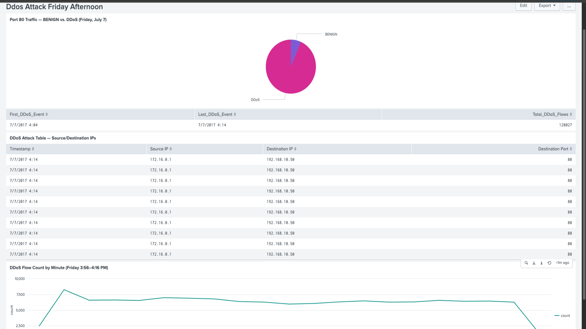
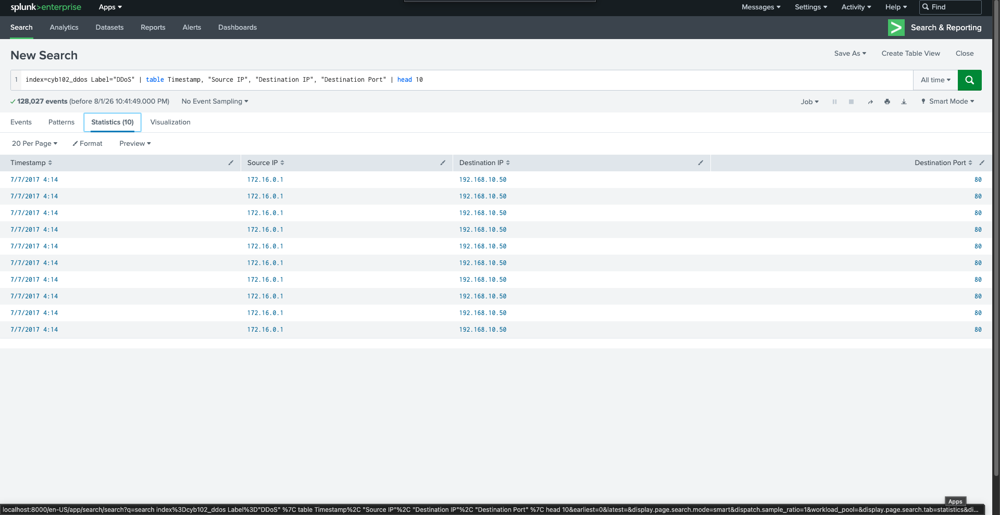
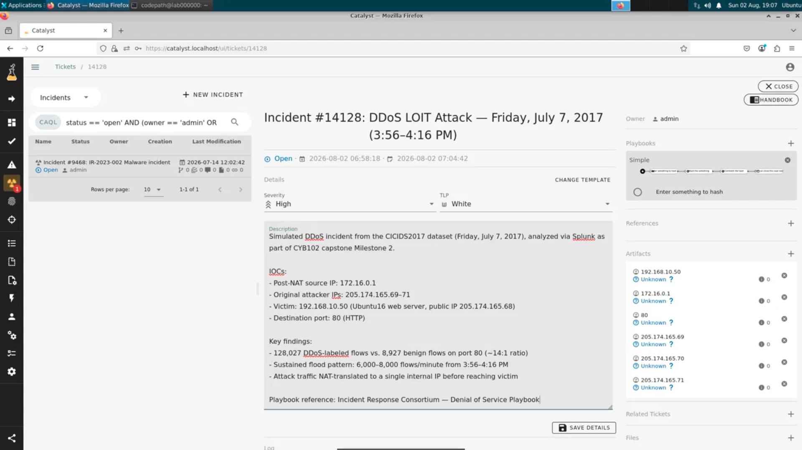

 DDoS Incident Response — CICIDS2017 (Friday LOIT Attack)

A SOC-style incident response investigation of a simulated DDoS attack, built as a capstone project for CodePath's CYB102 (Intermediate Cybersecurity) course. This project walks through the full incident response lifecycle — from dataset selection through detection, analysis, threat intelligence, and remediation — using Splunk for log analysis and Catalyst for case management.

## Team

- Diego Batres
- Hania Shuaib
- Joshua Linang

## Overview

**Dataset:** [CICIDS2017](https://www.unb.ca/cic/datasets/ids-2017.html), generated by the Canadian Institute for Cybersecurity (CIC) at the University of New Brunswick. The dataset simulates five days of enterprise network traffic (July 3–7, 2017), covering DoS, brute-force, web attacks, infiltration, botnet activity, port scans, and DDoS traffic captured behind a firewall with NAT.

**Scope:** This investigation focuses specifically on the **DDoS LOIT attack** on **Friday, July 7, 2017, afternoon** (documented window: 15:56–16:16).

- Attackers: three Windows 8.1 machines (205.174.165.69–71)
- Victim: Ubuntu16 web server (205.174.165.68, local IP 192.168.10.50)
- NAT process: attacker IPs → 205.174.165.80 (firewall) → 172.16.0.1 (internal)

**Playbook:** [Incident Response Consortium — Denial of Service Playbook](https://www.incidentresponse.com/mini-sites/playbooks/ddos), a 7-stage NIST-based process: Prepare, Detect, Analyze, Contain, Eradicate, Recover, Post-Incident.

**Tools:** Splunk (log ingestion and analysis), Catalyst (SOAR case management).

## Investigation Approach

Rather than searching Splunk at random, the investigation was structured around specific questions:

1. Did traffic suddenly increase?
2. When did it begin and end?
3. Who generated the traffic?
4. Who received the traffic?
5. Was one protocol/port abused?
6. Were other systems involved?
7. Did traffic return to normal?
8. Does the data match known LOIC/LOIT behavior?

### Hypotheses (pre-analysis)

1. Traffic volume to the victim's IP spikes sharply between 15:56–16:16, then returns to normal.
2. The three attacker IPs each show high connection counts to the same victim/port in that window.
3. Flow data shows signs of resource exhaustion — incomplete connections or repeated retransmissions.

## Key Findings

| Metric | Result |
|---|---|
| Attack window (observed) | 3:56 PM – ~4:15 PM |
| Total DDoS-labeled flows | 128,027 |
| Total benign flows | 97,718 |
| Source IP (post-NAT) | 172.16.0.1 |
| Original attacker IPs | 205.174.165.69, .70, .71 |
| Victim IP | 192.168.10.50 |
| Targeted port | 80 (HTTP) — 128,024 of 128,027 DDoS flows |
| Port 80 traffic ratio | 128,024 DDoS vs. 8,927 benign (~14:1) |

### Traffic Spike

Flow counts jumped from 2,438 to 8,244 in a single minute (3:56–3:57 PM), then sustained a plateau of roughly 6,000–8,000 flows/minute before dropping off sharply around 4:15–4:16 PM.



### Port 80 Dominance

During the attack window, the victim's HTTP traffic was almost entirely attack traffic — a roughly 14:1 ratio of malicious to benign flows.



### NAT Translation Discovery

The dataset documents that the three public attacker IPs (205.174.165.69–71) are translated by the firewall's NAT process into a single internal IP (172.16.0.1) before reaching the victim. This was confirmed directly in the flow data — every DDoS-labeled flow shows this single source IP, meaning a defender monitoring only internal traffic would see one apparent attacker, not three, without additional visibility into the firewall's NAT table.

### Flow Behavior: Volume, Not Size

Initial expectations (based on general DDoS/flooding behavior) assumed each malicious flow would be large — high packet counts, high byte counts, retransmissions. The data showed the opposite: DDoS flows carried *fewer* forward bytes per flow (32 bytes average) than benign flows (2,128 bytes average). The resource exhaustion mechanism was **flow volume**, not per-flow intensity — a large number of small, near-identical requests overwhelmed the server, rather than a smaller number of large ones. This is consistent with LOIC/LOIT's actual design as a low-sophistication, high-quantity flooding tool.

## Hypothesis Validation

| Hypothesis | Evidence | Conclusion |
|---|---|---|
| Traffic spikes 15:56–16:16, then returns to normal | Flow chart shows a sharp jump at 3:56 PM, sustained plateau, and drop-off around 4:15 PM | ✅ Supported |
| Three attacker IPs show high connection counts to the victim | All DDoS flows trace to a single NAT-translated IP (172.16.0.1); dataset documentation confirms the underlying 3-to-1 NAT translation | ⚠️ Supported, with revision |
| Flow data shows resource exhaustion via incomplete connections/retransmissions | DDoS flows had *lower* average bytes and packets per flow than benign traffic | ❌ Not supported as originally framed — exhaustion occurred through flow volume instead |

## Threat Intelligence

**Attack tool:** LOIC / LOIT (Low Orbit Ion Cannon) — a volumetric flooding tool, not an exploit-based attack. Historically used in coordinated, crowd-sourced attacks (e.g., by Anonymous), simulated here with three machines rather than a large-scale swarm.

**Expected behavior:** high connection volume from a small number of sources, targeting a single victim and service.

**What the evidence confirmed:** the attack matched LOIC's core signature — single victim, single service (port 80), overwhelming volume — while also revealing that firewall NAT can mask the true number of attacking sources from a defender working purely from internal network logs.

## Splunk Searches

```spl
# Confirm ingestion
index=cyb102_ddos

# Attack window boundaries
index=cyb102_ddos Label="DDoS"
| stats earliest(Timestamp) as First_DDoS_Event, latest(Timestamp) as Last_DDoS_Event, count as Total_DDoS_Flows

# Port 80 traffic breakdown
index=cyb102_ddos "Destination Port"="80"
| stats count by Label

# Source/destination confirmation
index=cyb102_ddos Label="DDoS"
| table Timestamp, "Source IP", "Destination IP", "Destination Port"

# Flow volume over time
index=cyb102_ddos Label="DDoS"
| stats count by Timestamp | sort Timestamp

# Flow behavior comparison
index=cyb102_ddos
| stats avg("Total Fwd Packets") as avg_fwd_pkts, avg("Total Backward Packets") as avg_bwd_pkts, avg("Total Length of Fwd Packets") as avg_fwd_bytes, avg("Total Length of Bwd Packets") as avg_bwd_bytes, avg("Flow Duration") as avg_duration by Label
```

## Recommended Remediation

Following the IRC Denial of Service Playbook's Contain, Eradicate, and Recover stages:

- **Contain:** Rate-limit or block the identified attacker IPs (205.174.165.69–71, or 172.16.0.1 at the internal boundary); apply temporary firewall rules restricting connection rates to the web server.
- **Eradicate:** Filter out malicious traffic patterns at the firewall/load balancer; ensure no persistent compromise on the victim beyond the traffic flood itself.
- **Recover:** Restore normal routing, monitor server performance for continued anomalies, and validate service availability for legitimate users.
- **Longer-term:** Implement rate limiting, a Web Application Firewall (WAF), and load balancing/traffic distribution to reduce single-point exposure to future volumetric attacks.

## Case Management

The incident was logged and tracked in Catalyst, a SOAR case management platform, including incident severity, TLP classification, indicators of compromise, and a full description tied to the playbook stages.



## Presentation

The full slide deck is available in [`slides/`](slides/).

## Dataset Citation

Iman Sharafaldin, Arash Habibi Lashkari, and Ali A. Ghorbani, "Toward Generating a New Intrusion Detection Dataset and Intrusion Traffic Characterization," ICISSP 2018.
